# BADASS Project Documentation

## Introduction

The **BADASS (Bgp At Doors of Autonomous Systems is Simple)** project aims to deepen the knowledge acquired through NetPractice by simulating several networks (VXLAN+BGP-EVPN) in **GNS3**.

#### Understanding BGP EVPN

**BGP EVPN** is underpinned by the _Border Gateway Protocol_ (BGP), as specified in [RFC 4271](https://tools.ietf.org/html/rfc4271), and its _Multi-Protocol_ extensions (MP-BGP), as outlined in [RFC 4760](https://tools.ietf.org/html/rfc4760).

`BGP` is the fundamental routing protocol of the Internet. With the capabilities introduced by `MP-BGP` extensions, BGP transcends its traditional role, enabling it to transport _Network Layer Reachability Information_ (NLRI) for a variety of protocols, including `IPv4`, `IPv6`, `L3 VPNs`, and notably in this project's context, `Ethernet VPN` (EVPN).

`EVPN` constitutes a unique address family within BGP for disseminating information about MAC addresses and the endpoints that utilize them. This project aims to leverage EVPN for effective MAC address management in a simulated network environment.

## Table of Contents

1. [GNS3 configuration with Docker](#gns3-configuration-with-docker)
   - [Setting Up Docker](#setting-up-docker)
   - [Installing GNS3 on Debian](#install-gns3-on-debian)
   - [Pull Needed Images from Docker Hub](#pull-needed-images-from-docker-hub)
   - [Automated Setup Script](#automated-setup-script)
   - [Integrating Docker Images into GNS3](#integrating-docker-images-into-gns3)
2. [Discovering a VXLAN](#discovering-a-vxlan)
   - [Building the Network Topology](#building-the-network-topology)
   - [Theoretical Insights on VXLAN](#theoretical-insights-on-vxlan)
   - [Static VXLAN Configuration](#static-vxlan-configuration)
   - [Static VXLAN Verification and Testing](#static-vxlan-verification-and-testing)
   - [Dynamic Multicast VXLAN Configuration](#dynamic-multicast-vxlan-configuration)
   - [Dynamic Multicast VXLAN Verification and Testing](#dynamic-multicast-vxlan-verification-and-testing)
3. [Discovering BGP with EVPN](#discovering-bgp-with-evpn)
   - [Theoretical Insights on BGP EVPN](#theoretical-insights-on-bgp-evpn)
   - [Building the Network Topology](#building-the-network-topology)
   - [BGP EVPN over VXLAN Configuration](#bgp-evpn-over-vxlan-configuration)
   - [BGP EVPN over VXLAN Verification and Testing Overview](#bgp-evpn-over-vxlan-verification-and-testing-overview)
4. [References](#references)


## GNS3 configuration with Docker

To kick off your work with containerized applications, preparing your environment is key. This entails configuring **Docker**, a vital tool for container management and deployment. Follow these initial steps to ensure Docker is set up correctly on your system, paving the way for a smooth installation and operation of necessary tools and software.

### Setting Up Docker

Before installing Docker Engine for the first time on a new host machine, you need to set up the Docker apt repository. This allows you to install and update Docker from the repository.

#### Set up Docker's `apt` repository

1. Add Docker's official GPG key:

   ```bash
   sudo apt-get update
   sudo apt-get install ca-certificates curl
   sudo install -m 0755 -d /etc/apt/keyrings
   sudo curl -fsSL https://download.docker.com/linux/debian/gpg -o /etc/apt/keyrings/docker.asc
   sudo chmod a+r /etc/apt/keyrings/docker.asc
   ```

2. Add the repository to Apt sources:

   ```bash
   echo \
     "deb [arch=$(dpkg --print-architecture) signed-by=/etc/apt/keyrings/docker.asc] https://download.docker.com/linux/debian \
     $(. /etc/os-release && echo "$VERSION_CODENAME") stable" | \
     sudo tee /etc/apt/sources.list.d/docker.list > /dev/null
   sudo apt-get update
   ```

   > **Note:** If you use a derivative distro, such as Kali Linux, you may need to substitute the `$(. /etc/os-release && echo "$VERSION_CODENAME")` part of this command with the codename of the corresponding Debian release, such as `bookworm`.

#### Install Docker packages

To install the latest version of Docker, run:

```bash
sudo apt-get install -y docker-ce docker-ce-cli containerd.io docker-buildx-plugin docker-compose-plugin
```

After installing Docker, you need to add your user to the Docker group to manage Docker as a non-root user. This step enhances security and ease of use:

```bash
sudo usermod -a -G docker $USER
```

> **Note:** After adding your user to the _Docker group_, you must log out of your current session and log back in for the changes to take effect. This refreshes your group membership and applies the new permissions.

Verify the installation by running the `hello-world` image:

```bash
docker run hello-world
```

This command downloads a test image and runs it in a container. When the container runs, it prints out a confirmation message and exits.

Adding your user to the _Docker group_ is an important step for day-to-day Docker operations, as it allows you to run Docker commands without needing to prefix them with `sudo`, simplifying the process and enhancing security by avoiding unnecessary root access.

### Install GNS3 on Debian

This guide provides detailed steps for installing **GNS3**, a graphical network simulator, on Debian-based systems. Follow these instructions to set up GNS3 along with its dependencies, including `Dynamips` (Cisco router emulator), `GNS3 GUI`, and `GNS3 Server`.

#### Prerequisites

Ensure your system is up-to-date and has the necessary tools and libraries installed:

```bash
sudo apt update && sudo apt install -y python3-pip python3-dev git qemu-kvm qemu-utils libvirt-daemon-system libvirt-clients bridge-utils virt-manager uidmap xterm
```

#### Install Dynamips

`Dynamips` is an emulator for Cisco routers.

1. Install the required packages for building Dynamips:

   ```bash
   sudo apt install -y cmake libelf-dev libpcap-dev
   ```

2. Clone the Dynamips repository and compile it:

   ```bash
   git clone https://github.com/GNS3/dynamips.git
   cd dynamips
   mkdir build && cd build
   cmake ..
   make
   sudo make install
   ```

3. Verify the Dynamips installation:
   ```bash
   dynamips -v
   ```

#### Install uBridge

`uBridge` is a utility for connecting network interfaces. To install:

```bash
git clone https://github.com/GNS3/ubridge.git
cd ubridge
make
sudo make install
```

#### Install GNS3 GUI and GNS3 Server

1. Install `virtualenv` to create isolated Python environments:

   ```bash
   sudo apt install virtualenv
   ```

2. Create a virtual environment in your project directory:

   ```bash
   virtualenv venv
   ```

3. Activate the virtual environment:

   ```bash
   source venv/bin/activate
   ```

4. Install `GNS3 GUI`, `GNS3 Server`, and `PyQt5` within the virtual environment:
   ```bash
   pip3 install gns3-gui gns3-server pyqt5==5.14.0
   ```

#### Install Wireshark

`Wireshark` is a network protocol analyzer that allows you to capture and interactively browse the traffic running on a computer network. It is essential for network troubleshooting, analysis, and educational purposes.

1. Install `wireshark`:

   ```bash
   sudo apt install wireshark
   ```

2. Configure permissions for packet capturing:
   - Add your user to the `wireshark` group to allow packet capturing without root access.
     ```bash
     sudo usermod -a -G wireshark [your_username]  # Use your username here
     ```
   - Adjust permissions for `dumpcap` to enable non-root packet capture:
     ```bash
     sudo chmod 754 /usr/bin/dumpcap
     sudo setcap 'CAP_NET_RAW+eip CAP_NET_ADMIN+eip' /usr/bin/dumpcap
     ```
   - Verify that the permissions have been correctly set:
     ```bash
     getcap /usr/bin/dumpcap # This command should output: 'cap_net_raw,cap_net_admin=eip'
     ```

### Pull Needed Images from Docker Hub

To set up the environment with the required Docker images for this networking project, follow these steps:

#### Pull the FRR (Free Range Routing) Image

`FRRouting (FRR)` provides network routing protocols. It's essential for simulations involving complex routing scenarios. To download the FRR image from Docker Hub, execute the following command in your terminal:

```bash
docker pull quay.io/frrouting/frr:9.1.0
```

#### Pull the Alpine Image

`Alpine Linux` is a _lightweight, security-oriented_ Linux distribution. It's useful for creating minimal container instances. To download the Alpine image from Docker Hub, use the command:

```bash
docker pull alpine
```

#### Verify the Downloaded Images

After pulling the necessary images, you can verify that they are correctly downloaded and stored in your local Docker image registry by listing all the Docker images available on your system:

```bash
docker images
```

This command will display a list of all Docker images on your machine, including their repository names, tags, image IDs, creation times, and sizes. Ensure that `quay.io/frrouting/frr` and `alpine` are listed among the downloaded images to confirm that they are ready for use.

### Automated Setup Script

To streamline the setup process, an automated script named `setup.sh` can execute all the aforementioned installation and configuration steps. Running this script simplifies the initial setup, ensuring that Docker is properly configured, GNS3 is installed along with its dependencies, and the necessary Docker images are pulled from Docker Hub. Execute the following command in your terminal to run the setup script:

```bash
bash setup.sh
```

### Integrating Docker Images into GNS3

#### Launching GNS3

Start `GNS3` with the following command::

```bash
gns3
```

#### Adding a Router Image

1. Go to `Edit` -> `Preferences`, navigate to `Docker` -> `Docker Containers` -> `New`, select `Existing image`, then choose `frrouting/frr:latest` from the `Image list`.
2. Keep other settings at their defaults and click `Finish`.

#### Configuring the Router Image

1. In the `Browse End Devices` section, drag and drop the `frrouting-frr` onto the workspace.
2. Right-click on its icon and select `Auxiliary console`.
3. Create a VTYSH configuration file:

```bash
touch /etc/frr/vtysh.conf
```

4. Enable routing daemons by editing the daemons file:

```bash
sed -i 's/bgpd=no/bgpd=yes/; s/ospfd=no/ospfd=yes/; s/isisd=no/isisd=yes/' /etc/frr/daemons
```

#### Making Changes Persistent

1. Stop the Docker container using:
   ```bash
   docker stop [container_id]  # Use the container ID or name here
   ```
2. Commit the changes to create a new Docker image:
   ```bash
   docker commit [container_id] frrouting-badass
   ```
3. In GNS3, under `Edit` -> `Preferences` -> `Docker` -> `Docker Containers`, delete the old container.
4. Add the new image by selecting `New` -> `Existing image` and choosing `frrouting-badass:latest` from the `Image list`.
5. Enter `routeur_[your_username]` in the `Name` field.
6. Set `Adapters` count to `8`, leave the rest at defaults, and click `Finish`.

   > **Tip**: When referring to `[container_id]` in steps 1 and 2, you can use the `Tab` key for auto-completion to easily find your Docker container.

#### Adding a Host Image

1. Repeat the process in the `Docker Containers` window by selecting `New` -> `Existing image`, and pick `alpine:latest` from the `Image list`.
2. Enter `host_[your_username]` in the `Name` field.
3. Set `Adapters` count to `4`, leave the rest at defaults, and click `Finish`.

#### Automating Configuration with the Makefile

To streamline the configuration process outlined above, a `Makefile` has been provided within the `P1` folder. This Makefile automates the aforementioned steps, such as setting up Docker containers, configuring the router and host images, and committing changes for persistence. To execute these steps automatically, simply navigate to the `P1` folder and run the following command in your terminal:

```bash
make all
```

#### Verifying Your Setup

Upon successfully following the steps for integrating Docker images into GNS3 and configuring them, your GNS3 workspace along with the xterm windows displaying the processes should resemble the screenshot provided:

<p align="center">
  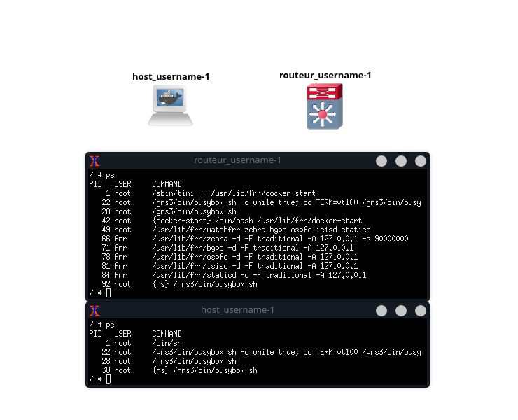
</p>

## Discovering a VXLAN

In this chapter, we delve into the practical setup and understanding of **VXLAN (Virtual Extensible LAN)** in `GNS3`.

VXLAN is a network virtualization technology designed to provide scalable, secure LAN segmentation. It allows for the creation of a large number of virtualized _Layer 2 networks_ over a _Layer 3 infrastructure_.

### Theoretical Insights on VXLAN

**VXLAN (Virtual Extensible LAN)** technology plays a pivotal role in modern data centers and cloud computing environments by overcoming the limitations of traditional network segmentation solutions. Unlike standard VLANs, which are constrained by a 4096 identifier space, VXLAN offers over **16 million unique network identifiers**, enabling extensive multi-tenancy and network isolation capabilities essential for large-scale virtualized environments.

At the heart of VXLAN's operation is the **VXLAN Tunnel Endpoint (VTEP)**, responsible for encapsulating Ethernet frames into UDP packets for transmission over an IP network, and de-encapsulating them upon receipt. This encapsulation process allows Layer 2 frames to traverse a Layer 3 network, effectively creating a virtual network over a physical network infrastructure. This mechanism not only enhances scalability but also supports more flexible network segmentation and efficient utilization of network resources.

### Building the Network Topology

The initial step involves creating a network topology that includes 2 *hosts*, 2 *routers*, and an *ethernet switch* to facilitate the VXLAN configuration. This setup aims to demonstrate the effectiveness of VXLAN in bridging separate network segments transparently.

1. Drag and Drop Components: From the GNS3 toolbar, select and drag two `hosts`, two `routers`, and one `Ethernet switch` onto the workspace.

2. Connect the Devices: Following the provided schematic, connect the devices to mimic the physical layout of a typical VXLAN deployment.

The intended topology should resemble the visual guide below:

<p align="center">
	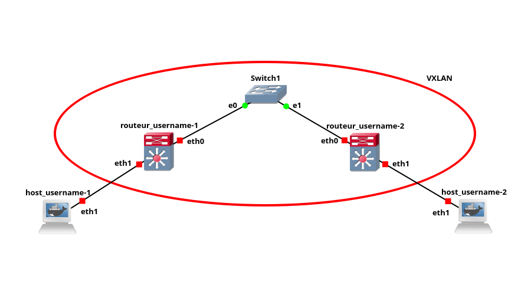
</p>

### Static VXLAN Configuration

After establishing the network topology, the subsequent phase involves configuring the VXLAN tunnel. This tunnel will encapsulate Layer 2 Ethernet frames in Layer 3 IP packets, allowing for seamless connectivity between disparate network segments.

#### Configuring VXLAN on Routers

VXLAN with an ID of 10, referred to as `vxlan10`, will be established, along with a bridge interface `br0`. This setup facilitates communication across the network, leveraging VXLAN technology for extended network segmentation.

- Router `routeur_[your_username]-1` Configuration:

  Configure the first router to initiate the VXLAN tunnel and bridge connection. This includes setting up the bridge interface, configuring the IP address for Ethernet and VXLAN interfaces, and linking them to the bridge.

  ```bash
  # Create a new Linux bridge named br0 and bring it up to ensure it's operational.
  ip link add br0 type bridge
  ip link set dev br0 up

  # Assign an IP address to eth0 to facilitate local network connectivity. This interface acts as a gateway or a local network interface on the router.
  ip addr add 10.1.1.1/24 dev eth0

  # Create a VXLAN interface named vxlan10 with a VXLAN Network Identifier (VNI) of 10.
  # Configure it to use eth0 for encapsulated traffic, specifying the remote VXLAN endpoint's IP and the local IP to use.
  # The dstport 4789 specifies the standard VXLAN port for traffic.
  ip link add name vxlan10 type vxlan id 10 dev eth0 remote 10.1.1.2 local 10.1.1.1 dstport 4789

  # Assign an IP address to the vxlan10 interface. This IP is used for inter-VXLAN communication, allowing devices across VXLANs to communicate as if they were on the same physical network.
  ip addr add 20.1.1.1/24 dev vxlan10

  # Ensure the vxlan10 interface is up to start handling traffic.
  ip link set dev vxlan10 up

  # Add eth1 to the bridge, allowing devices connected to this interface to communicate with devices on the VXLAN.
  ip link set dev eth1 master br0

  # Similarly, add the vxlan10 interface to the bridge, integrating VXLAN traffic into the bridged network. This enables seamless layer 2 connectivity across the underlying layer 3 network.
  ip link set dev vxlan10 master br0

  ```

- Router `routeur_[your_username]-2` Configuration:

  Similarly, configure the second router, ensuring to adjust the remote and local IP addresses to reflect the topology accurately.

  ```bash
  ip link add br0 type bridge
  ip link set dev br0 up

  ip addr add 10.1.1.2/24 dev eth0
  ip link add name vxlan10 type vxlan id 10 dev eth0 remote 10.1.1.1 local 10.1.1.2 dstport 4789
  ip addr add 20.1.1.2/24 dev vxlan10

  ip link set dev vxlan10 up
  ip link set dev eth1 master br0
  ip link set dev vxlan10 master br0
  ```

#### Configuring Hosts

Each host within the VXLAN network requires proper IP address configuration to communicate over the network. This step involves assigning IP addresses to the Ethernet interfaces of the hosts.

- Host `host_[your_username]-1` Configuration:

  Assign an IP address to the first host, enabling it to communicate within the VXLAN.

  ```bash
  ip addr add 30.1.1.1/24 dev eth1
  ```

- Host `host_[your_username]-2` Configuration:

  Configure the second host's Ethernet interface with an IP address, following the same procedure as the first host.

  ```bash
  ip addr add 30.1.1.2/24 dev eth1
  ```

#### Automating Configuration with a Script

To simplify and automate the configuration process detailed in the previous steps, a script named `conf.sh` has been created and is available within the `P2` folder. This script encompasses all the necessary commands to configure both routers and hosts as outlined.

To execute the script run the following command in your terminal:

```bash
bash ./conf.sh
```
and select option `1. Static VXLAN configuration`

### Static VXLAN Verification and Testing

After configuring the VXLAN network, it's essential to ensure everything is functioning as intended. This involves two key steps: testing connectivity via `ping` and analyzing the traffic with `Wireshark`.

#### Testing Connectivity with Ping

To confirm that the VXLAN tunnel is operational and that the hosts can communicate through it, execute `ping` tests between the hosts.

- `ping` from `host_[your_username]-1` to `host_[your_username]-2`:


```bash
ping 30.1.1.2
```
- `ping` from `host_[your_username]-2` to `host_[your_username]-1`:
```bash
ping 30.1.1.1
```

These ping tests help verify that the IP addresses are correctly assigned and that the hosts can communicate through the VXLAN tunnel, indicating successful network layer connectivity.

<p align="center">
	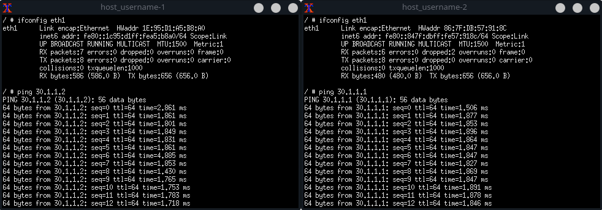
</p>

#### Analyzing VXLAN Traffic with Wireshark

For a more in-depth analysis, use `Wireshark` to capture and inspect the packets flowing through the VXLAN.

- Starting a Capture Session:

  To begin capturing packets, right-click on an `Ethernet link` between a router and the switch (where the VXLAN is configured) in the GNS3 topology, then select `Start capture`. Wireshark will open and start capturing packets on that link.

- Analyzing Traffic:

  In Wireshark, optinally apply the filter `vxlan` to focus on VXLAN traffic. This filter isolates the encapsulated traffic, allowing to examine the VXLAN packets in detail, including the original Ethernet frames they encapsulate.

Observing the encapsulated packets in Wireshark confirms that VXLAN is functioning as expected, encapsulating Layer 2 traffic over the Layer 3 network.

<p align="center">
	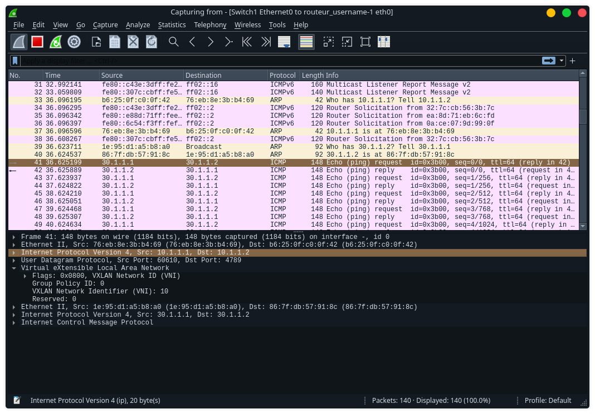
	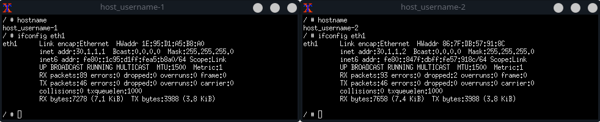
</p>

### Dynamic Multicast VXLAN Configuration

In transitioning from a **static VXLAN** configuration to a **dynamic multicast VXLAN** setup, the core change involves utilizing multicast technology to facilitate dynamic, efficient data distribution across the network. *Multicast* allows for the transmission of data to multiple destinations simultaneously using a single multicast group address, enhancing the scalability and efficiency of VXLAN deployments in environments where broadcast, unknown unicast, or multicast traffic needs to be efficiently distributed across the network.

#### Understanding Multicast in VXLAN

Multicast addresses in VXLAN environments are used to dynamically manage and distribute VXLAN traffic among multiple endpoints. When a VXLAN endpoint sends a packet to a multicast group, the network infrastructure ensures that the packet is delivered to all members of the VXLAN segment associated with that group. This approach is particularly beneficial for dynamic environments, reducing the need for extensive manual configuration and allowing for more scalable network designs.

#### Adjusting VXLAN Configuration for Multicast

The key modification in the configuration involves specifying a multicast group for VXLAN traffic instead of defining static remote IP addresses for each VXLAN tunnel.

- Modified Router Configuration Command:

  Replace the static VXLAN tunnel configuration with a multicast group configuration. The command below demonstrates this change, applicable to both routers in the setup:
  ```bash
  ip link add name vxlan10 type vxlan id 10 dev eth0 group 239.1.1.1 dstport 4789
  ```
This command creates a VXLAN interface `vxlan10` with a specific VNI of 10, associating it with a multicast group `239.1.1.1`. This multicast group address is used for VXLAN traffic distribution, allowing for dynamic communication between VXLAN endpoints.

> The initial configuration steps outlined in the *Static VXLAN Configuration* remain the same, with the exception of the VXLAN tunnel command.

#### Automating Configuration with a Script

As with the static VXLAN setup, you can leverage the `conf.sh` script located in the `P2` folder to streamline the configuration process for the dynamic multicast VXLAN. After restarting the machines in `GNS3` to ensure a clean environment, execute the script in your terminal:
```bash
bash ./conf.sh
```
and select option `2. Dynamic Multicast VXLAN configuration`

### Dynamic Multicast VXLAN Verification and Testing

For verifying and testing the dynamic multicast VXLAN configuration, the same steps outlined in the [Static VXLAN Verification and Testing](#static-vxlan-verification-and-testing) section should be mimicked. This includes conducting ping tests between hosts to ensure connectivity and utilizing Wireshark to analyze the traffic for VXLAN encapsulated packets.

Upon successful configuration, our machines join the multicast group `239.1.1.1`, as illustrated in the screenshot below:

<p align="center">
	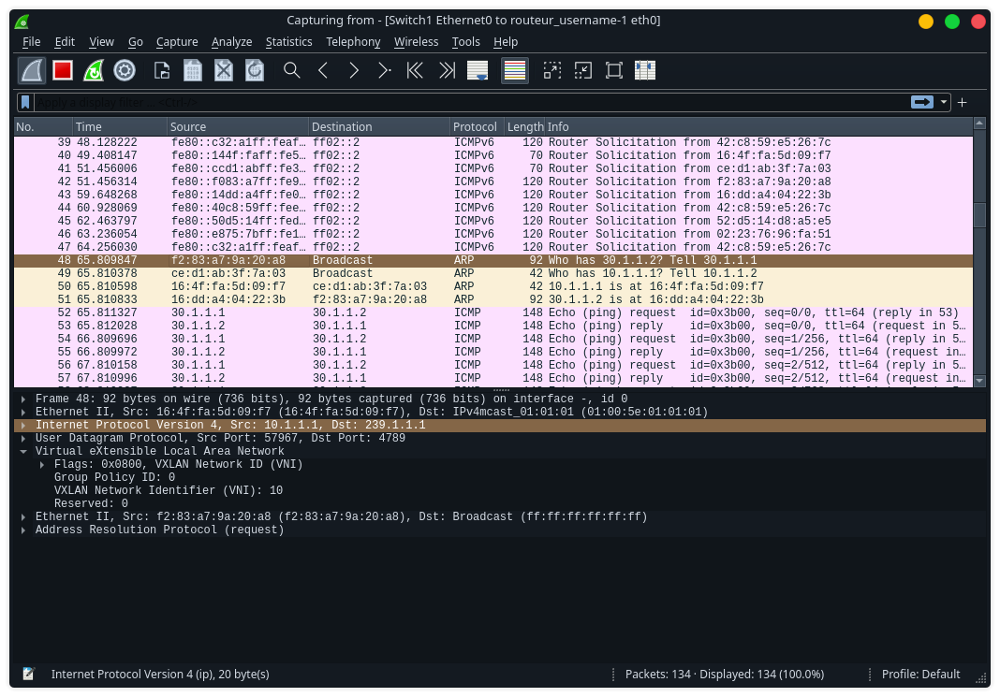
	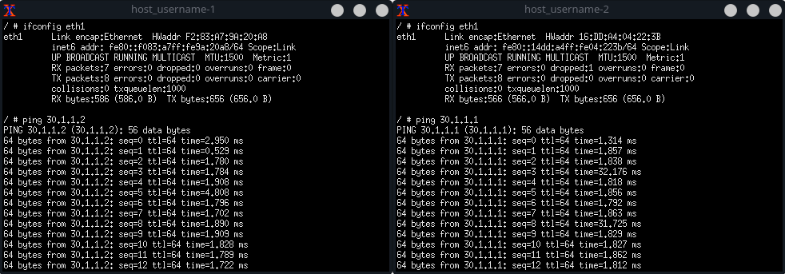
</p>

## Discovering BGP with EVPN

In this chapter, we delve into the practical setup and understanding of **BGP EVPN (Ethernet VPN)**, a pivotal advancement in network segmentation and dynamic MAC address learning. We'll explore the integration of BGP EVPN with our previously established VXLAN network (ID 10). Opting for simplicity, this exploration foregoes MPLS, showcasing BGP EVPN's capacity to foster efficient and scalable network designs, particularly beneficial within data center contexts.

### Theoretical Insights on BGP EVPN

**BGP EVPN (Ethernet VPN)** represents a significant advancement in network virtualization, offering a scalable and dynamic solution for MAC address learning and network segmentation across VXLANs. Defined in [RFC 7432](https://tools.ietf.org/html/rfc7432), BGP EVPN leverages Multiprotocol BGP (MP-BGP) to distribute MAC address information, providing optimal forwarding paths and eliminating the need for traditional flood-and-learn behavior in Layer 2 networks.

The use of BGP EVPN in conjunction with VXLAN allows for the creation of a robust control plane that manages VXLAN overlay networks. This setup not only enhances the scalability of network architectures but also supports advanced features such as multi-tenancy, segmented routing, and the seamless integration of disparate data centers. Furthermore, the introduction of route reflectors in a BGP EVPN environment centralizes route distribution, reducing the complexity and overhead associated with managing large-scale networks.

Integrating **OSPF** for underlay routing simplifies IP connectivity across the network, ensuring efficient and reliable communication between BGP EVPN components. This synergy between OSPF and BGP EVPN underlines the holistic approach required for modern network virtualization, where both the overlay and underlay networks are optimized for performance, scalability, and resilience.


### Building the Network Topology

Our setup includes a *controller* (route reflector) and 3 *leaf nodes* (VTEPs), each connected to a *host*. This configuration represents a simplified data center network, employing `BGP EVPN` for dynamic routing and segmentation without the complexity of MPLS.

1. Drag and Drop Components: From the GNS3 toolbar, select and drag 3 `hosts` and 4 `routers` onto the workspace.

2. Connect the Devices: Following the provided schematic, connect the devices to mimic the physical layout of a typical VXLAN deployment.

The intended topology should resemble the visual guide below:

<p align="center">
	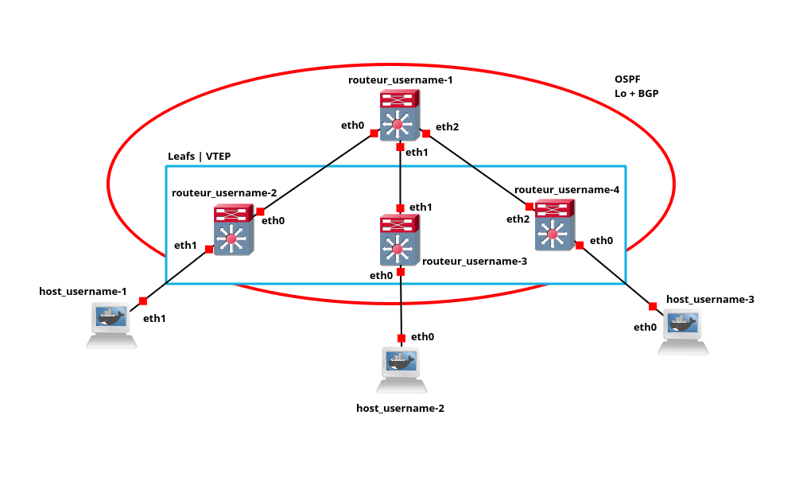
</p>

### BGP EVPN over VXLAN Configuration

This section provides a detailed guide on setting up BGP EVPN over VXLAN, using OSPF for simplified IP routing and establishing dynamic BGP peering relationships via route reflection. This configuration enhances network scalability and segmentation, leveraging the VXLAN technology we established earlier.

#### Controller/Route Reflector Configuration

Router `routeur_[your_username]-1` serves as the central control unit and route reflector, facilitating BGP EVPN routes among the leaf nodes.

  ```bash
  vtysh # Start VTY shell for CLI access
  conf t # Enter configuration mode
  hostname routeur_[your_username]-1 # Set device hostname for identification
  no ipv6 forwarding # Disable IPv6 forwarding, focusing on IPv4

  # Configure Ethernet interfaces with IP addresses for connectivity to leaf nodes
  interface eth0
   ip address 10.1.1.1/30
  !
  interface eth1
   ip address 10.1.1.5/30
  !
  interface eth2
   ip address 10.1.1.9/30

  # Configure loopback interface for stable BGP peering
  interface lo
   ip address 1.1.1.1/32

  # Setup BGP with route reflection for EVPN, using AS 1
  router bgp 1
   neighbor ibgp peer-group # Define an internal BGP peer group
   neighbor ibgp remote-as 1 # Specify remote AS for iBGP peers
   neighbor ibgp update-source lo # Use loopback for source of updates
   bgp listen range 1.1.1.0/29 peer-group ibgp # Listen for peers in this range
   address-family l2vpn evpn # Enter EVPN address family configuration
    neighbor ibgp activate # Activate EVPN for the peer group
    neighbor ibgp route-reflector-client # Designate peers as route-reflector clients
   exit-address-family

  # Configure OSPF for internal routing, covering all IP addresses
  router ospf
   network 0.0.0.0/0 area 0
  exit
  ```

#### Leaf Node Configuration

Routers 2, 3, and 4 are configured as leaf nodes within the BGP EVPN network. This setup facilitates network segmentation and dynamic MAC address learning, leveraging the VXLAN overlay for enhanced network virtualization and segmentation.

- Router `routeur_[your_username]-2` and `routeur_[your_username]-4` Configuration:
  > These routers are integrated into the VXLAN overlay, participating in BGP EVPN for network segmentation and scalability.
  ```bash
  # Create a bridge and VXLAN interface for VXLAN overlay networking
  ip link add br0 type bridge
  ip link set dev br0 up
  ip link add vxlan10 type vxlan id 10 dstport 4789
  ip link set dev vxlan10 up
  ip link set dev eth1 master br0 # Change to eth0 for Router 4
  ip link set dev vxlan10 master br0

  vtysh
  conf t
  hostname routeur_[your_username]-2 # Change to hostname for Router 4 accordingly
  no ipv6 forwarding # Disable IPv6 forwarding, focusing on IPv4

  # Configure Ethernet interface for OSPF
  interface eth1 # Change to eth0 for Router 4
   ip address 10.1.1.2/30 # Change to 10.1.1.10/30 for Router 4
   ip ospf area 0

  # Configure loopback interface for stable BGP peering and OSPF
  interface lo
   ip address 1.1.1.2/32 # Change to 1.1.1.4/32 for Router 4
   ip ospf area 0

  # Setup BGP for EVPN signaling, using AS 1
  router bgp 1
   neighbor 1.1.1.1 remote-as 1 # Peer with route reflector
   neighbor 1.1.1.1 update-source lo # Use loopback for source of updates
   address-family l2vpn evpn
    neighbor 1.1.1.1 activate # Activate EVPN for this neighbor
    advertise-all-vni # Advertise all VNIs for VXLAN segmentation
  exit

  router ospf # Additional OSPF configuration, if needed
  exit
  ```

- Router `routeur_[your_username]-3` configuration:
  > Router 3 participates in BGP EVPN sessions, configured without VXLAN overlay integration for this example.

  ```bash
  vtysh
  conf t
  hostname routeur_[your_username]-3
  no ipv6 forwarding

  interface eth1
   ip address 10.1.1.6/30
   ip ospf area 0

  interface lo
   ip address 1.1.1.3/32
   ip ospf area 0

  router bgp 1
   neighbor 1.1.1.1 remote-as 1
   neighbor 1.1.1.1 update-source lo
   address-family l2vpn evpn
    neighbor 1.1.1.1 activate
  exit

  router ospf
  exit
  ```
### BGP EVPN over VXLAN Verification and Testing Overview

This section provides a comprehensive overview of verifying and testing the BGP EVPN over VXLAN network setup. It demonstrates the network's operational visibility, route configurations, dynamic discovery processes, and connectivity tests, showcasing the robustness and dynamic nature of BGP EVPN over VXLAN.

#### Verifying VTEP Connectivity

- **VTEP Visibility from `routeur_[your_username]-4`:** Demonstrates network visibility from VTEP `4` to the other three VTEPs.

  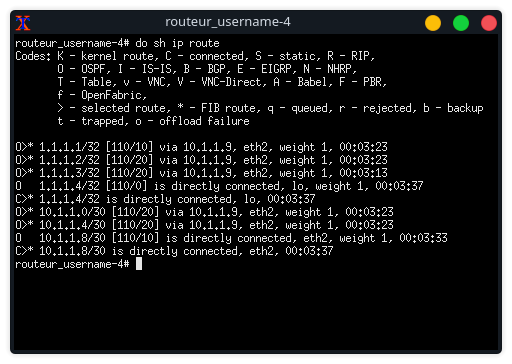

#### Route Configuration and Verification

- **Single Route with Controller (RR):** Initially, only one route is observed with the *Route Reflector (RR)*, indicating a controlled start.

  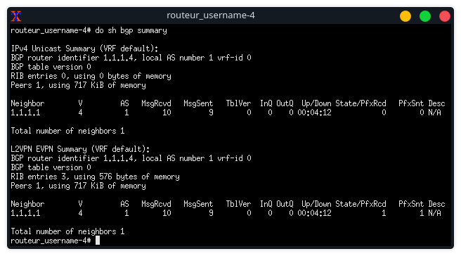

- **VNI and Preconfigured Routes Observation:** Before any host activation, VNI 10 and preconfigured type 3 routes are visible, with an expected absence of type 2 routes.

  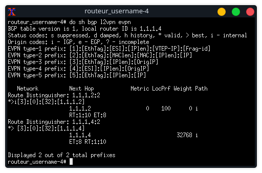

#### Dynamic MAC Address Discovery and Route Generation

- **Router 2 EVPN State Before Host Activation:** EVPN state of Router 2 before any host is turned on, serving as a baseline for subsequent observations.

  

- **Dynamic Discovery and Type 2 Route Creation on `routeur_[your_username]-2`:** After activating `host_[your_username]-1`, VTEP `2` dynamically discovers the MAC address of active machines and auto-generates a type 2 route.

  

  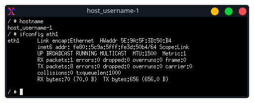

- **Type 2 Route Creation on `routeur_[your_username]-4` VTEP:** The activation of a host triggers the creation of a new route type 2 on VTEP `4`, generated by our RR.

  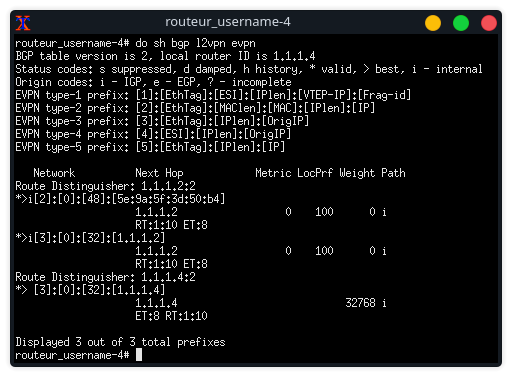

- **Activation of a Second Host (`host_[your_username]-3`):** Following the activation of a second machine, a second type 2 route is observed, highlighting the dynamic and responsive routing capability.

  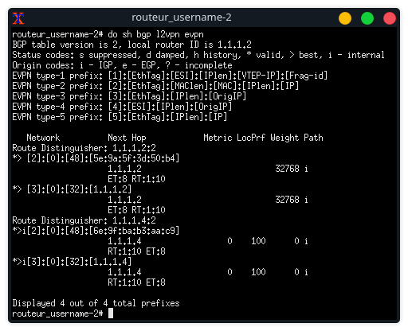

#### Connectivity Testing

- **Ping Test for Connectivity Verification:** A simple ping test confirms connectivity across all machines using RR and VTEPs, showcasing VXLAN ID 10 and the presence of ICMP and OSPF packets.

  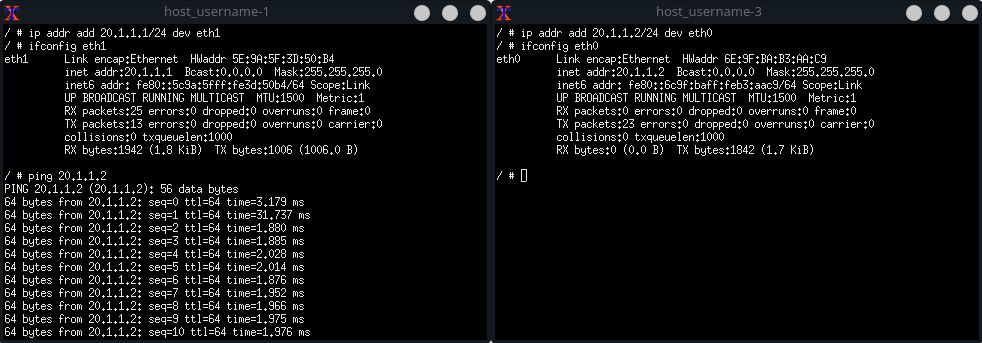

  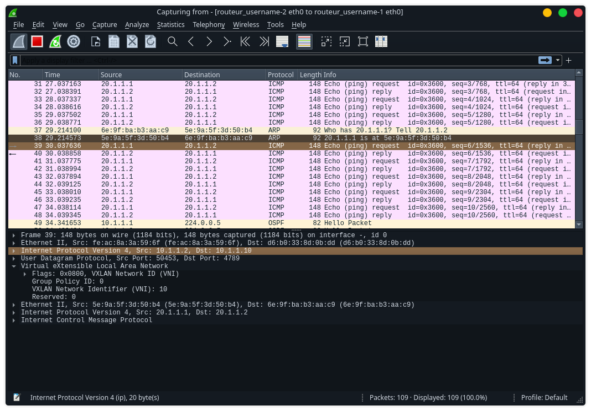

The above documentation and visual aids illustrate the process of verifying and testing a BGP EVPN over VXLAN setup. It highlights the system's ability to dynamically adapt to network changes, such as host activations, and maintain robust connectivity across the network infrastructure.


## References

- **GNS3: FRRouting Using Docker Platform**

  [](https://www.youtube.com/watch?v=D4nk5VSUelg "GNS3: FRRouting Using Docker Platform")

- **GNS3: FRRouting Using Docker Platform - VXLANs**

  [](https://www.youtube.com/watch?v=u1ka-S6F9UI "GNS3: FRRouting Using Docker Platform - VXLANs")

- **GNS3: FRRouting Using Docker Platform - EVPN**

  [](https://www.youtube.com/watch?v=Ek7kFDwUJBM "GNS3: FRRouting Using Docker Platform - EVPN")

- **Why behind VXLAN with BGP EVPN | Webinar | VXLAN from Scratch**

  [](https://www.youtube.com/watch?v=DDj7gvx-584 "Why behind VXLAN with BGP EVPN | Webinar | VXLAN from Scratch")

- **What is EVPN-VXLAN Anyways?**

  [](https://www.youtube.com/watch?v=cdvstTm467k "What is EVPN-VXLAN Anyways?")

- **EVPN VXLAN - Learn The Basics**

  [](https://www.youtube.com/watch?v=3zjf1dPB_Es "EVPN VXLAN - Learn The Basics")
