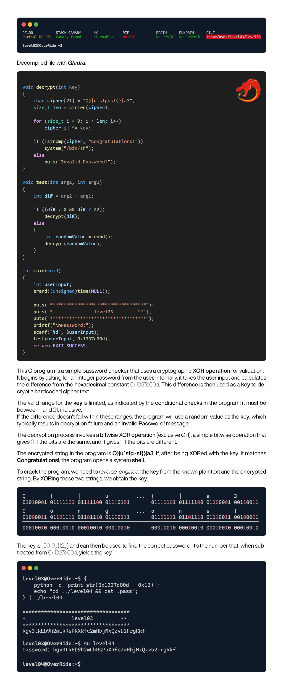

# OverRide

## Project Description

OverRide is a project centered around cybersecurity, focusing on binary exploitation techniques in i386 systems. It provides a hands-on experience for programmers to explore and understand system vulnerabilities, highlighting the significance of secure coding practices in software development.

This repository contains detailed walkthroughs and solutions for the OverRide project, tailored to deepen the practical skills and theoretical knowledge of cybersecurity enthusiasts in the area of binary exploitation.

## Solutions Index

| Levels                | Description                                  |
| --------------------- | -------------------------------------------- |
| [./level00](#level00) | Hardcoded Password Vulnerability             |
| [./level01](#level01) | Buffer Overflow & Ret2Shellcode Technique    |
| [./level02](#level02) | Format String Attack Exploration             |
| [./level03](#level03) | XOR Cipher Decryption                        |
| [./level04](#level04) | Buffer Overflow & Custom Ret2Shellcode       |
| [./level05](#level05) | Format String Attack & Shellcode Integration |
| [./level06](#level06) | Hash Algorithm Reverse Engineering           |
| [./level07](#level07) | Buffer Overflow & UINT Overflow & Ret2Lib    |
| [./level08](#level08) | Relative Path Hijacking                      |
| [./level09](#level09) | Off-by-One Error & Buffer Overflow           |

# ./level00

# ./level01

# ./level02

# ./level03

# ./level04

# ./level05

# ./level06

# ./level07

# ./level08

# ./level09

