# SnowCrash

## Project Description

SnowCrash is an introductory project on computer security, designed to acquaint developers with security across various sub-domains. Emphasizing a developer-oriented approach, the project guides participants through an exploration of multiple programming languages (ASM, Perl, PHP, etc.), fostering the development of a keen logic for understanding unfamiliar programs. Through hands-on experience, Snow Crash aims to illuminate the critical importance of meticulous programming practices and the far-reaching implications of seemingly minor coding errors in software development.

This repository hosts comprehensive guides and solutions for each level of the SnowCrash project, designed to enhance understanding and practical application of computer security principles.

## Solutions Index

| Levels                | Description                                                                 |
| --------------------- | --------------------------------------------------------------------------- |
| [./level00](#level00) | Discovering a hidden file & password cracking                               |
| [./level01](#level01) | Cracking a password hash with John the Ripper                               |
| [./level02](#level02) | Analyzing network traffic with Wireshark to find a password                 |
| [./level03](#level03) | Exploiting a simple command injection vulnerability                         |
| [./level04](#level04) | Utilizing a Perl script vulnerability for command execution                 |
| [./level05](#level05) | Exploring a scheduled script to execute arbitrary commands                  |
| [./level06](#level06) | Breaking PHP code logic to execute unintended code                          |
| [./level07](#level07) | Manipulating environment variables to execute unintended script             |
| [./level08](#level08) | Bypassing access control to read a restricted file                          |
| [./level09](#level09) | Decoding a custom string obfuscation to reveal a password                   |
| [./level10](#level10) | Leveraging a race condition to access restricted content                    |
| [./level11](#level11) | Injecting commands into a server listening on a network port                |
| [./level12](#level12) | Executing arbitrary code through a web app vulnerability                    |
| [./level13](#level13) | Gaining privilege escalation through manipulation of executable permissions |
| [./level14](#level14) | Overcoming binary protections to execute privileged operations              |

# ./level00

[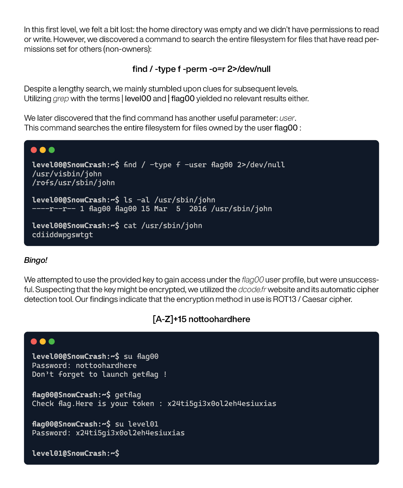](https://github.com/lorenzoedoardofrancesco/42Cursus/raw/main/SnowCrash/level00/resources/level00.pdf)

# ./level01

[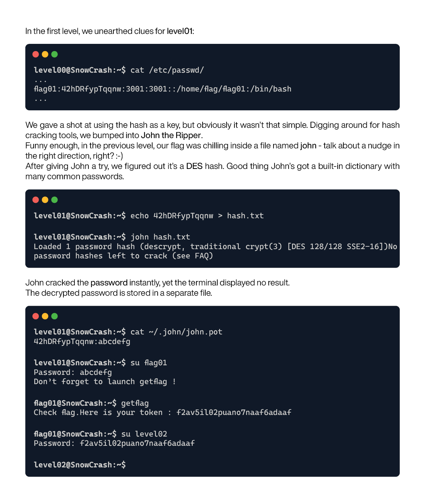](https://github.com/lorenzoedoardofrancesco/42Cursus/raw/main/SnowCrash/level01/resources/level01.pdf)

# ./level02

[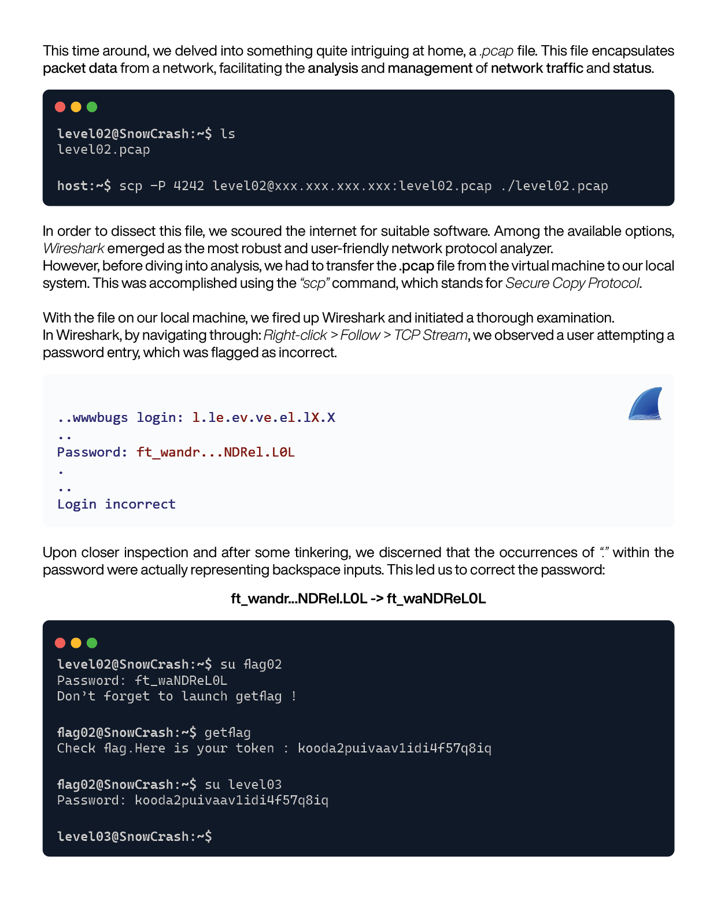](https://github.com/lorenzoedoardofrancesco/42Cursus/raw/main/SnowCrash/level02/resources/level02.pdf)

# ./level03

[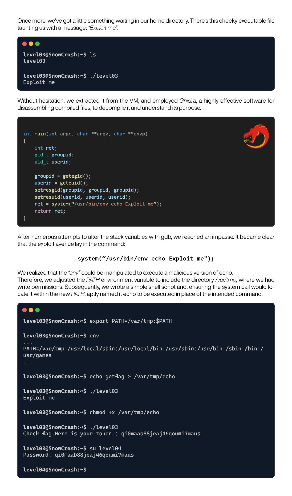](https://github.com/lorenzoedoardofrancesco/42Cursus/raw/main/SnowCrash/level03/resources/level03.pdf)

# ./level04

[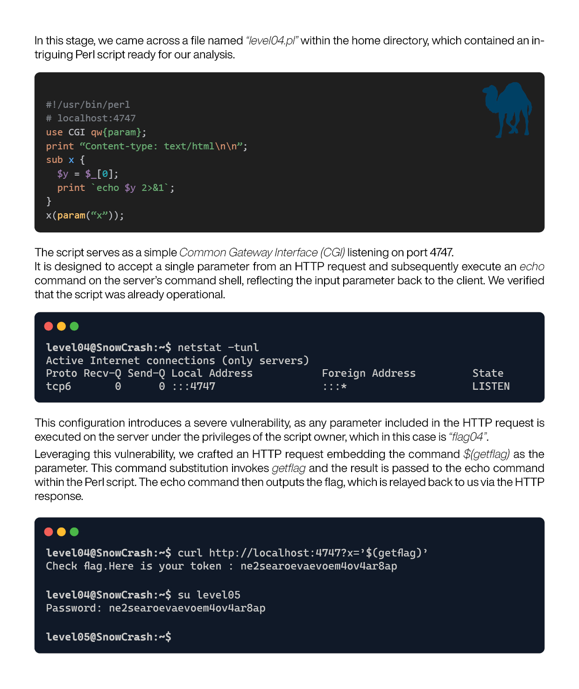](https://github.com/lorenzoedoardofrancesco/42Cursus/raw/main/SnowCrash/level04/resources/level04.pdf)

# ./level05

[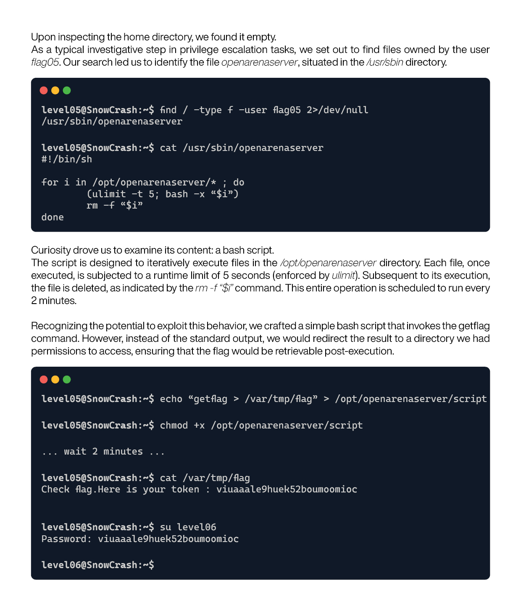](https://github.com/lorenzoedoardofrancesco/42Cursus/raw/main/SnowCrash/level05/resources/level05.pdf)

# ./level06

[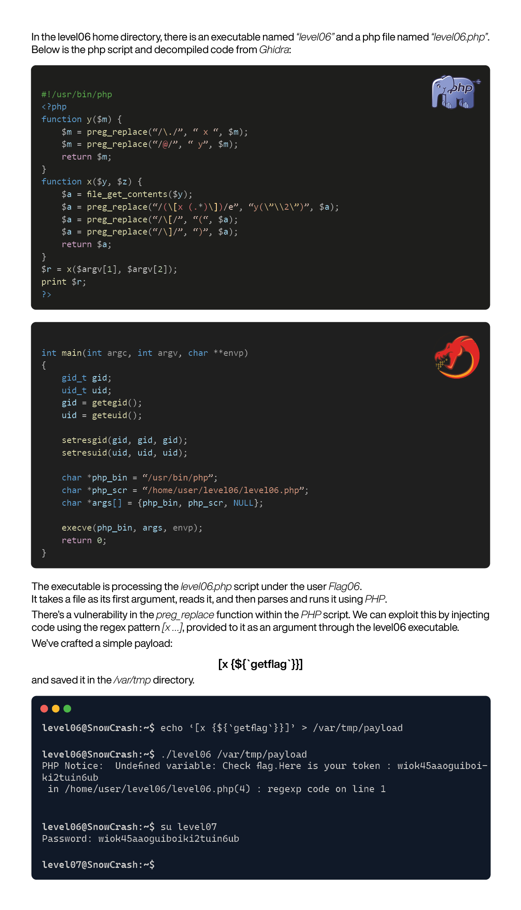](https://github.com/lorenzoedoardofrancesco/42Cursus/raw/main/SnowCrash/level06/resources/level06.pdf)

# ./level07

[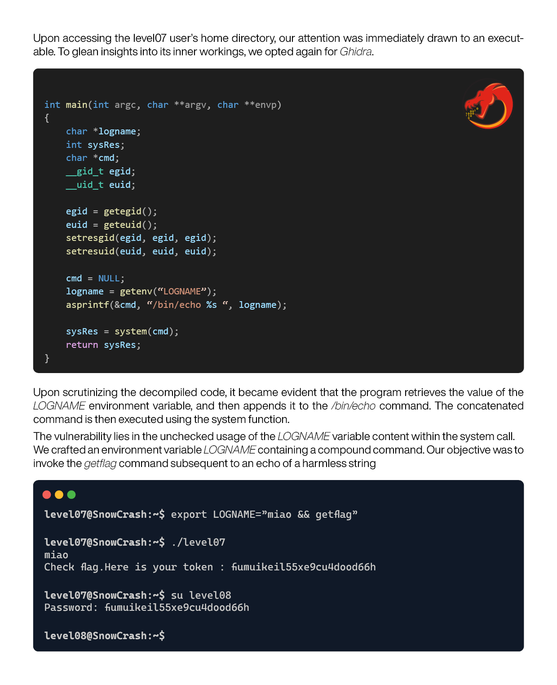](https://github.com/lorenzoedoardofrancesco/42Cursus/raw/main/SnowCrash/level07/resources/level07.pdf)

# ./level08

[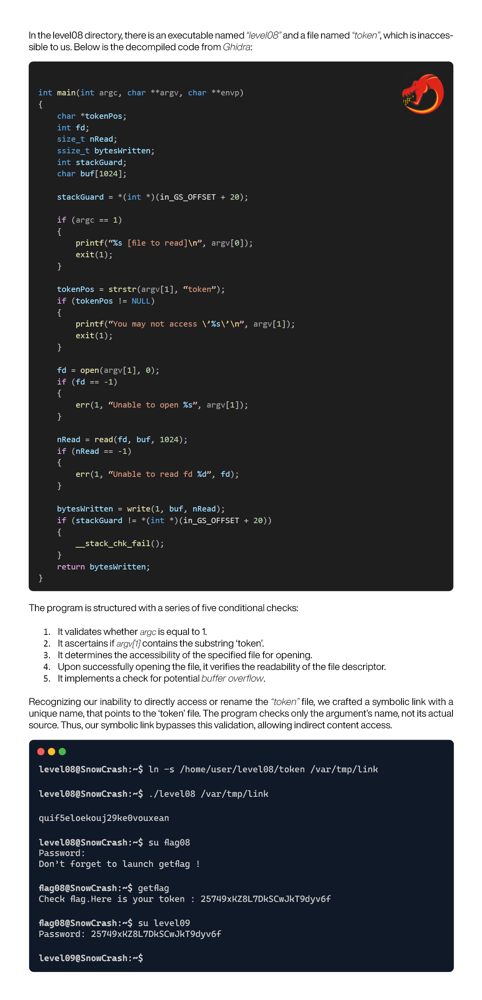](https://github.com/lorenzoedoardofrancesco/42Cursus/raw/main/SnowCrash/level08/resources/level08.pdf)

# ./level09

[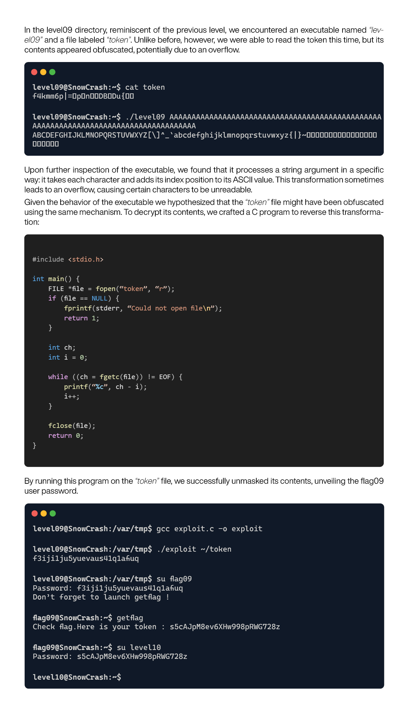](https://github.com/lorenzoedoardofrancesco/42Cursus/raw/main/SnowCrash/level09/resources/level09.pdf)

# ./level10

[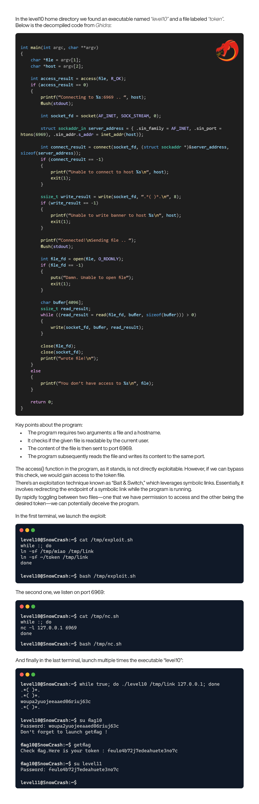](https://github.com/lorenzoedoardofrancesco/42Cursus/raw/main/SnowCrash/level10/resources/level10.pdf)

# ./level11

[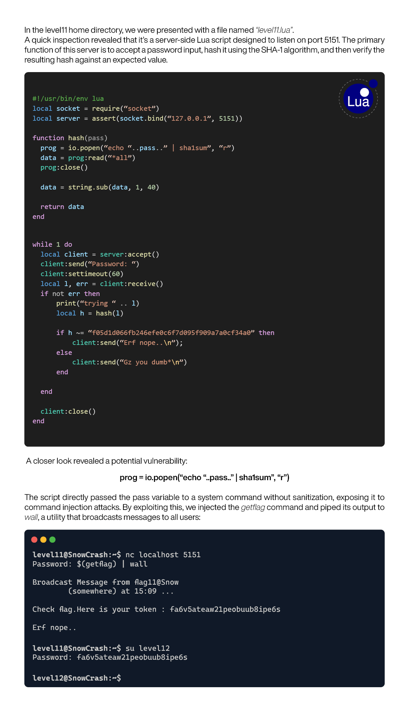](https://github.com/lorenzoedoardofrancesco/42Cursus/raw/main/SnowCrash/level11/resources/level11.pdf)

# ./level12

[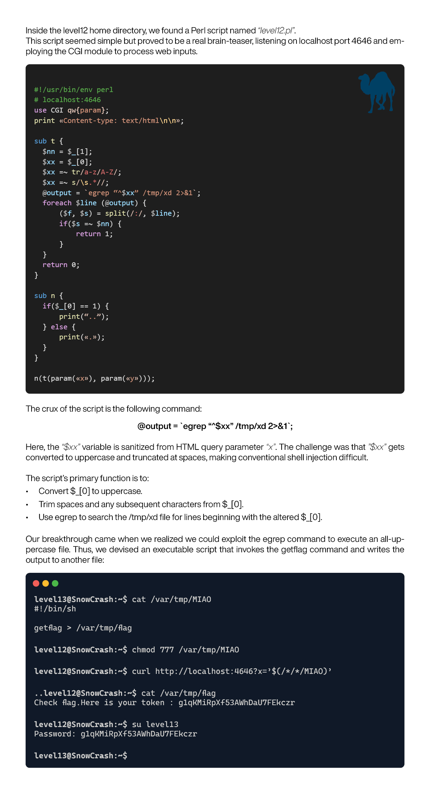](https://github.com/lorenzoedoardofrancesco/42Cursus/raw/main/SnowCrash/level12/resources/level12.pdf)

# ./level13

[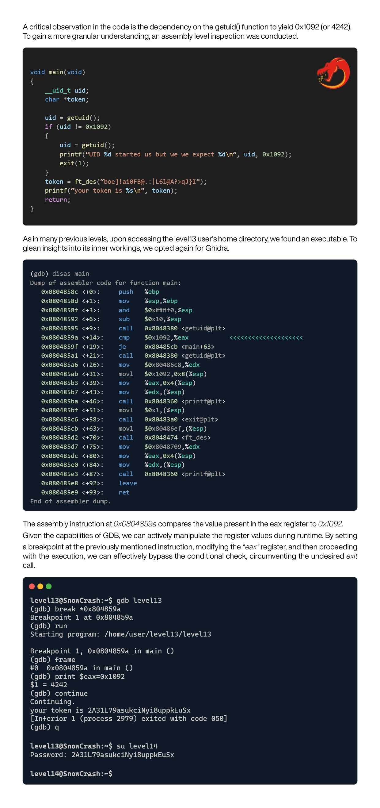](https://github.com/lorenzoedoardofrancesco/42Cursus/raw/main/SnowCrash/level13/resources/level13.pdf)

# ./level14

[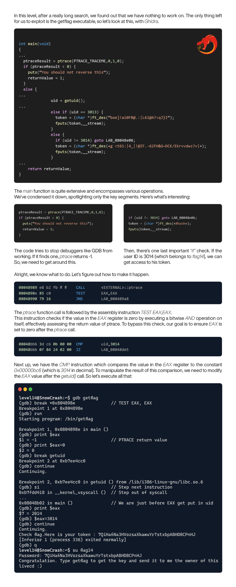](https://github.com/lorenzoedoardofrancesco/42Cursus/raw/main/SnowCrash/level14/resources/level14.pdf)
